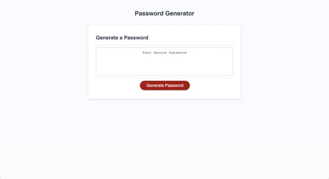

# Random-password

## Description

As a security conscious person, I wanted an application that could generate random passwords for me. I built this application using javascript.

## Installation

N/A

## Usage

Click the red “Generate Password” button on the page and follow the prompts. The program will produce a random password that is the specified length, and that contains the character types you select.

Link to deployed page: https://neilmkflyingk.github.io/random-password/

## Credits

The source code for this project can be found at this pathway: “Assets/source-code”

## License

Please refer to the license listed in the GitHub repository.
